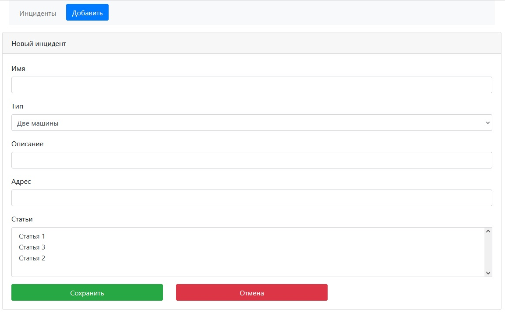

# проект "Автонарушители"

## О проекте 

Вид системы. Главная страница - таблица со всеми нарушениями.
Пользователь добавляет описание автонарушение.
В заявлении указываются: адрес, статьи, описание нарушения.

## Стек технологий:

    Spring boot 2.7.6
    Thymeleaf 3.0.15
    Bootstrap 4.3.1
    Hibernate 5.6.11.Final
    PostgreSql 42.5.1
    Liquibase 4.15
    Lombok 1.18.22
    Java 17

## Требования к окружению:

    Java 17
    Maven 3.8
    PostgreSql 14

## Запуск проекта:

- скачать проект
- создать базу данных: ```create database accidents;```
- запусть Main class, расположение: ru.job4j.accidents
- Открыть в браузере [ссылку](http://localhost:8080/)

## Взаимодействие с приложением:

#### Взаимодействие с приложением начинается со страницы входа.


#### На главной странице находятся все инциденты.

- кнопка "Добавить" переводит на страницу создания нового инцидента.
  

#### При нажатии на номер инцидента, происходит переход на страницу редактирования.


## Telegram для связи с разработчиком:

@Stanislav_Bogatyrev
[ссылка](https://t.me/Stanislav_Bogatyrev)